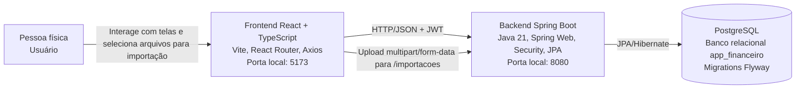

# Arquitetura do SmartBudget — Modelo C4

Este documento descreve a arquitetura atual do SmartBudget utilizando o modelo C4. A documentação foi produzida a partir do estado real do projeto, considerando o frontend React, o backend Spring Boot e o banco de dados configurado no repositório.

> Observação: a issue solicita que o diagrama de contêineres mostre um banco MySQL. Porém, a implementação atual do projeto utiliza PostgreSQL, conforme `application.properties`, dependências Gradle e migrations Flyway. Por isso, este documento representa PostgreSQL para manter aderência ao sistema realmente implementado.

## 1. Visão geral

O SmartBudget é um sistema de gerenciamento financeiro pessoal. O MVP atual permite cadastro e autenticação de usuários, criação e listagem de contas, cadastro manual de transações, listagem de categorias, categorização de transações e importação de arquivos financeiros em formatos como CSV, XML, TXT e NF-e.

A arquitetura está organizada em uma aplicação frontend React, uma API backend Spring Boot e um banco relacional PostgreSQL. A comunicação entre frontend e backend ocorre via HTTP/JSON. As rotas protegidas usam autenticação por token JWT enviado no cabeçalho `Authorization: Bearer <token>`.

## 2. C4 — Nível 1: Diagrama de contexto


### Elementos do contexto

| Elemento | Responsabilidade | Dependências |
| --- | --- | --- |
| Pessoa física | Usuário final que deseja controlar gastos, contas, categorias, transações e importar arquivos financeiros. | Navegador web para acessar o sistema. |
| SmartBudget | Sistema que centraliza autenticação, contas, transações, categorias e importações de arquivos financeiros. | Aplicação frontend React, API backend Spring Boot e banco relacional PostgreSQL. |

### Sistemas externos identificados

No estado atual do projeto, não há integração direta com bancos, provedores de pagamento, serviços externos de autenticação ou APIs de terceiros. Os arquivos financeiros não são representados como sistema externo no diagrama, pois entram no fluxo como dados enviados manualmente pelo usuário durante o uso da aplicação.

## 3. C4 — Nível 2: Diagrama de contêineres



Os arquivos financeiros importados, como CSV, TXT, XML e NF-e, aparecem como dados trafegados entre o frontend e o backend, não como um contêiner próprio. O processamento desses arquivos acontece dentro do backend, por meio dos parsers de importação.

## 4. Contêineres e responsabilidades

### 4.1 Frontend React

**Local:** `app-financeiro-front-end/`

O frontend é uma aplicação web construída com React, TypeScript e Vite. Ele concentra as telas usadas pelo usuário e consome a API do backend por meio do serviço Axios configurado em `src/services/api.ts`.

Principais responsabilidades:

- Exibir telas de login e cadastro.
- Guardar o token JWT no `localStorage` após login ou cadastro.
- Incluir automaticamente o token JWT no cabeçalho `Authorization` das requisições autenticadas.
- Permitir navegação entre páginas com `react-router-dom`.
- Fornecer telas para criação de conta e lançamento manual de transações.
- Consumir endpoints de contas, categorias e transações.

Principais arquivos:

| Arquivo | Responsabilidade |
| --- | --- |
| `src/App.tsx` | Define as rotas principais da aplicação: login, cadastro, dashboard provisório, nova transação e nova conta. |
| `src/contexts/ContextoAutenticacao.tsx` | Centraliza login, cadastro, token JWT, estado de autenticação e logout. |
| `src/services/api.ts` | Configura Axios, URL base do backend e interceptador que injeta o token JWT. |
| `src/pages/Login.tsx` | Tela de autenticação do usuário. |
| `src/pages/Cadastro.tsx` | Tela de criação de perfil. |
| `src/pages/NovaConta.tsx` | Tela para registrar contas financeiras. |
| `src/pages/NovaTransacao.tsx` | Tela para registrar transações manualmente. |

Dependências principais:

- React e React DOM para construção da interface.
- React Router DOM para navegação.
- Axios para comunicação HTTP com o backend.
- Vite e TypeScript para ambiente de desenvolvimento e build.

### 4.2 Backend Spring Boot

**Local:** `app-financeiro-back-end/`

O backend é uma API REST implementada com Java 21 e Spring Boot. Ele concentra regras de negócio, autenticação, autorização, persistência, importação de arquivos e exposição dos endpoints consumidos pelo frontend.

Principais responsabilidades:

- Registrar usuários e autenticar credenciais.
- Gerar e validar tokens JWT.
- Proteger rotas da API com Spring Security.
- Registrar e listar contas do usuário autenticado.
- Registrar transações manuais.
- Listar categorias padrão e categorias do usuário.
- Categorizar transações existentes.
- Importar extratos e NF-e a partir de arquivos enviados pelo usuário.
- Persistir entidades no banco relacional usando Spring Data JPA.
- Controlar evolução do banco com Flyway.

Principais camadas MVC/backend:

| Camada | Pacotes/arquivos | Responsabilidade |
| --- | --- | --- |
| Controller | `controller/*Controller.java` | Receber requisições HTTP, validar entrada básica, acionar serviços e devolver respostas HTTP. |
| Service | `service/*Service.java` | Concentrar regras de negócio, validações de propriedade do usuário e fluxo de importação. |
| Mapper | `mapper/*Mapper.java` | Converter entidades de domínio em DTOs de resposta da API. |
| Model | `model/*.java` | Representar entidades persistidas, como `Usuario`, `Conta`, `Transacao`, `Categoria`, `Importacao`, `Fatura` e `CartaoCredito`. |
| Repository | `repository/*Repository.java` | Acessar o banco por meio de Spring Data JPA. |
| DTO | `dto/**` | Definir contratos de entrada e saída da API sem expor diretamente as entidades. |
| Parser | `parser/**` | Interpretar arquivos CSV, TXT, XML genérico e NF-e, convertendo dados importados em transações. |
| Security/Config | `security/**` e `config/**` | Configurar CORS, JWT, filtros de autenticação, criptografia de senha e autorização das rotas. |

Endpoints principais identificados:

| Endpoint | Método | Responsabilidade |
| --- | --- | --- |
| `/auth/register` | `POST` | Cadastrar usuário e retornar token JWT. |
| `/auth/login` | `POST` | Autenticar usuário e retornar token JWT. |
| `/health` | `GET` | Verificar saúde da API. |
| `/contas` | `GET` | Listar contas do usuário autenticado. |
| `/contas/registrar` | `POST` | Registrar nova conta para o usuário autenticado. |
| `/categorias` | `GET` | Listar categorias padrão e categorias do usuário. |
| `/transacoes/manual` | `POST` | Registrar transação manual. |
| `/transacoes/{transacaoId}/categoria` | `PATCH` | Alterar categoria de uma transação. |
| `/importacoes` | `POST` | Importar arquivo financeiro via `multipart/form-data`. |
| `/importacoes/{id}/status` | `GET` | Consultar status de uma importação. |

Dependências principais:

- Spring Boot Web para API REST.
- Spring Security para autenticação e autorização.
- JJWT para geração e validação de tokens JWT.
- Spring Data JPA e Hibernate para persistência.
- PostgreSQL Driver para conexão com o banco atual.
- Flyway para migrations.
- OpenCSV e Jackson XML para importação/leitura de arquivos.
- JUnit, Spring Security Test e JaCoCo para testes e cobertura.

### 4.3 Banco de dados PostgreSQL

**Local de configuração:** `app-financeiro-back-end/src/main/resources/application.properties`

O banco relacional persiste os dados centrais do SmartBudget. A estrutura é criada por migrations Flyway em `src/main/resources/db/migration`.

Principais tabelas:

| Tabela | Responsabilidade |
| --- | --- |
| `usuario` | Armazena usuários cadastrados, e-mail, CPF, senha criptografada e data de criação. |
| `contas` | Armazena contas financeiras do usuário, como conta corrente, poupança, cartão de crédito ou carteira. |
| `cartao_credito` | Complementa contas do tipo cartão de crédito com fechamento, vencimento e limite. |
| `categoria` | Armazena categorias padrão e categorias vinculadas a usuários. |
| `importacao` | Registra arquivos importados, formato, status, quantidade de linhas, sucessos e falhas. |
| `fatura` | Representa faturas de cartão de crédito. |
| `transacoes` | Armazena lançamentos financeiros manuais ou importados, com conta, categoria, valor, data, tipo e forma de pagamento. |

Dependências:
- Backend Spring Boot via JDBC/JPA.
- Migrations Flyway para criação e atualização do esquema.

## 5. Componentes internos relevantes do backend

### Autenticação e segurança

A autenticação é baseada em JWT. O fluxo atual é:

1. O usuário faz cadastro ou login pelo frontend.
2. O backend valida os dados em `UsuarioService`.
3. A senha é criptografada com `BCryptPasswordEncoder`.
4. O backend gera um token JWT usando `JwtUtil`.
5. O frontend salva o token no `localStorage`.
6. O interceptor Axios adiciona `Authorization: Bearer <token>` nas próximas requisições.
7. O `JwtAuthFilter` valida o token e injeta o usuário autenticado no contexto do Spring Security.

Rotas de autenticação e saúde são públicas. As demais rotas exigem usuário autenticado.

### Contas

O módulo de contas permite registrar e listar contas financeiras do usuário. `ContaController` recebe as requisições HTTP, `ContaService` aplica a regra de negócio e `ContaRepository` persiste os dados.

Esse módulo apoia o MVP porque transações e importações precisam estar vinculadas a uma conta específica.

### Categorias

O módulo de categorias permite listar categorias padrão do sistema e categorias específicas do usuário. As categorias são usadas para classificar gastos como alimentação, transporte, saúde, lazer, habitação, serviços e manutenção.

Esse módulo apoia a visualização futura de relatórios por categoria.

### Transações

O módulo de transações permite registrar manualmente lançamentos financeiros, editar, excluir, listar e categorizar transações do usuário autenticado.

Na Sprint 4, o `TransacaoService` foi reengenhado para atuar como coordenador dos casos de uso, delegando responsabilidades auxiliares:

| Componente | Responsabilidade no módulo |
| --- | --- |
| `TransacaoService` | Orquestra criação, edição, exclusão, listagem paginada e categorização de transações. |
| `ContaUsuarioService` | Resolve a conta da transação e valida se ela pertence ao usuário autenticado. |
| `CategoriaService` | Busca categoria por ID e valida se ela pode ser usada pelo usuário. |
| `SugestaoCategoriaService` | Sugere categoria padrão a partir da descrição (palavras-chave). |
| `TransacaoMapper` | Converte `Transacao` em `TransacaoResponseDTO`. |

Esse módulo é central para o MVP porque representa os gastos e receitas controlados pelo usuário. A decomposição está registrada na ADR-0008.

### Importações

O módulo de importação processa arquivos enviados pelo usuário. `ImportacaoController` recebe upload `multipart/form-data`, `ImportacaoService` seleciona o parser compatível, aplica sugestão de categoria via `SugestaoCategoriaService` e registra o resultado da importação.

Parsers implementados:

| Parser | Formatos/uso |
| --- | --- |
| `ParserCSV` | Extratos CSV com detecção de delimitador e parsing de data, descrição, valor e tipo. |
| `ParserTXT` | Extratos em texto estruturado. |
| `ParserXML` | XML genérico de extratos bancários. |
| `ParserNFe` | Nota Fiscal Eletrônica em XML ou `.nfe`. |

Esse módulo apoia o MVP ao reduzir o trabalho manual de lançamento de gastos.

#### Contrato comum dos parsers

O módulo de importação utiliza a interface `ParserExtrato` como contrato comum entre o `ImportacaoService` e os parsers concretos (`ParserCSV`, `ParserTXT`, `ParserXML` e `ParserNFe`).

Cada parser é responsável por duas operações principais:

1. `aceita(MultipartFile arquivo)`: indica se o parser reconhece o arquivo recebido.
2. `parsear(MultipartFile arquivo, Conta conta)`: converte os registros válidos do arquivo em transações.

A decisão de `aceita()` deve considerar a extensão do arquivo e, quando necessário, uma prévia do conteúdo. O `Content-Type` enviado pelo cliente não deve ser a única fonte de decisão, pois pode ser genérico ou incorreto.

O método `parsear()` retorna um `ResultadoParser`, contendo:

| Campo | Responsabilidade |
| --- | --- |
| `transacoes` | Lista somente com transações válidas extraídas do arquivo. |
| `totalLinhas` | Quantidade de registros avaliados pelo parser. |
| `linhasInvalidas` | Quantidade de registros ignorados por inconsistência. |

O contrato permite sucesso parcial. Isso significa que, se parte do arquivo for válida e parte inválida, o parser deve retornar as transações válidas e contabilizar os registros inválidos, sem interromper toda a importação.

As transações criadas pelos parsers devem conter conta, data, descrição, valor, tipo e `categorizada=false`. Já a associação com a entidade `Importacao`, a sugestão de categoria, a persistência e a atualização de status são responsabilidades do `ImportacaoService`.

### Tratamento de erros

O projeto possui `GlobalExceptionHandler` para tratar exceções como recurso não encontrado e argumentos inválidos, além de handlers específicos no `AuthController` para conflitos, dados inválidos e falhas de autenticação.

## 6. Como a arquitetura MVC apoia o MVP

A ADR-0004 define MVC como estratégia de arquitetura e camadas. No estado atual, essa decisão apoia o MVP pelos seguintes motivos:

- **Separação de responsabilidades:** controllers cuidam da API HTTP, services concentram regras de negócio, models representam dados e repositories isolam persistência.
- **Evolução incremental:** novas funcionalidades e evoluções pós-RC, como relatórios visuais completos, dashboard completo e extrato futuro, podem ser adicionadas criando novos controllers/services sem misturar responsabilidades nas telas.
- **Testabilidade:** services e parsers podem ser testados sem depender diretamente da interface web. O projeto já possui testes para autenticação, registro manual e parsers de importação.
- **Aderência ao Spring Boot:** a arquitetura acompanha o padrão natural do framework, reduzindo complexidade para a equipe.
- **Organização entre frontend e backend:** o frontend atua como camada de apresentação, enquanto o backend centraliza regras, segurança e dados.

## 7. Relação da arquitetura com as funcionalidades do MVP

| Funcionalidade do MVP | Como a arquitetura atual apoia |
| --- | --- |
| Criação de perfil pessoal com autenticação | Frontend possui telas de login/cadastro; backend possui `AuthController`, `UsuarioService`, JWT, Spring Security e persistência de usuários. |
| Adicionar gastos manualmente | Frontend possui tela de nova transação; backend expõe `/transacoes/manual` e persiste em `transacoes`. |
| Leitura de extratos e NF-e | Backend possui `/importacoes` e parsers para CSV, TXT, XML e NF-e. |
| Categorizar gastos | Backend possui categorias persistidas e endpoint para alterar categoria de transação. |
| Categorizar por forma de pagamento | Modelo de transação possui `forma_pagamento`, com enum para PIX, cartão, dinheiro, boleto e TED/DOC. |
| Categorizar por cartão/banco utilizado | Transações pertencem a uma `Conta`, que possui tipo e banco. A categorização por cartão/banco existe com ressalva quando envolve faturas ou fluxo completo de cartão de crédito. |
| Visualização de gastos mensais | O backend possui resumo mensal e agrupamento por categoria; o dashboard mensal completo no frontend permanece com ressalva/evolução. |
| Extrato futuro | O modelo possui campo `futura`, faturas e classes de apoio, mas o extrato futuro como fluxo funcional ficou pendente/fora do RC. |

## 8. Restrições e decisões atuais

- A aplicação é monolítica no backend, não distribuída em microserviços.
- A comunicação frontend/backend é síncrona via HTTP.
- A autenticação é stateless via JWT.
- O banco atual é PostgreSQL, não MySQL.
- Não há integração direta com contas bancárias ou APIs externas no MVP atual.
- Arquivos financeiros são enviados manualmente pelo usuário.
- O dashboard mensal completo ainda está em evolução no frontend.
- Extrato futuro, parcelamentos e faturas de cartão de crédito como fluxo funcional não foram concluídos no RC.

## 9. Como rodar os contêineres lógicos em desenvolvimento

Frontend:

```bash
cd app-financeiro-front-end
npm install
npm run dev
```

Backend:

```bash
cd app-financeiro-back-end
./gradlew bootRun
```

Banco PostgreSQL local (via Docker Compose):

```bash
docker compose up -d
```

## 10. Padrões de Projeto (Design Patterns) Aplicados

Para resolver problemas de acoplamento e regras de negócio complexas, o backend do SmartBudget utiliza padrões de projeto clássicos (GoF). O destaque principal no MVP é o uso do padrão **Strategy**.

### Padrão Strategy: Módulo de Importação

A funcionalidade de importação permite que o usuário envie extratos de diferentes fontes e formatos (CSV, TXT, XML, NF-e). Em vez de centralizar a lógica de interpretação de todos os arquivos em um único serviço monolítico e cheio de condicionais (`if/else`), foi aplicado o padrão **Strategy**.

**Como funciona no código:**

1. **A Interface (A Estratégia):** Foi criada a interface `ParserExtrato`, que formaliza o contrato comum dos parsers por meio dos métodos `aceita(MultipartFile arquivo)` e `parsear(MultipartFile arquivo, Conta conta)`. Esse contrato define quando um parser deve aceitar um arquivo, como deve retornar sucessos parciais e quais campos da transação são responsabilidade do parser.
2. **As Implementações (Estratégias Concretas):** Classes como `ParserCSV`, `ParserXML` e `ParserNFe` implementam a interface, contendo a lógica específica para traduzir bytes daquele formato específico em objetos `Transacao`.
3. **O Contexto:** A classe `ImportacaoService` recebe via injeção de dependência do Spring uma lista de todas as estratégias disponíveis (`List<ParserExtrato> parsers`).

**Fluxo de Execução:**

Quando um arquivo chega via requisição, o `ImportacaoService` itera sobre as estratégias chamando o método `aceita()`. O primeiro parser que retornar `true` é escolhido dinamicamente e acionado via método `parsear()`.

**Benefício (Open/Closed Principle):**

Se o SmartBudget precisar suportar arquivos PDF ou OFX no futuro, a equipe precisará apenas criar uma nova classe `ParserOFX` que implemente `ParserExtrato`. O `ImportacaoService` não precisará sofrer nenhuma alteração estrutural, garantindo segurança contra regressões.

### Decomposição de serviços: Módulo de Transações

Na Sprint 4, o `TransacaoService` deixou de concentrar regras auxiliares de conta, categoria, sugestão automática e mapeamento de DTO. A decisão segue o princípio de responsabilidade única dentro da camada de serviços.

**Como funciona no código:**

1. **Coordenador:** `TransacaoService` valida campos obrigatórios e executa o fluxo de cada caso de uso (registrar, editar, excluir, listar, categorizar).
2. **Serviços especializados:** `ContaUsuarioService`, `CategoriaService` e `SugestaoCategoriaService` concentram regras reutilizáveis entre transações manuais e importação.
3. **Mapper:** `TransacaoMapper` isola a montagem de `TransacaoResponseDTO`.

**Benefício:**

Alterações em sugestão de categoria ou resolução de conta podem ser testadas e evoluídas sem modificar toda a classe de transações. O `ImportacaoService` deixa de depender do `TransacaoService` apenas para sugerir categoria.

**Referência:** ADR-0008.
