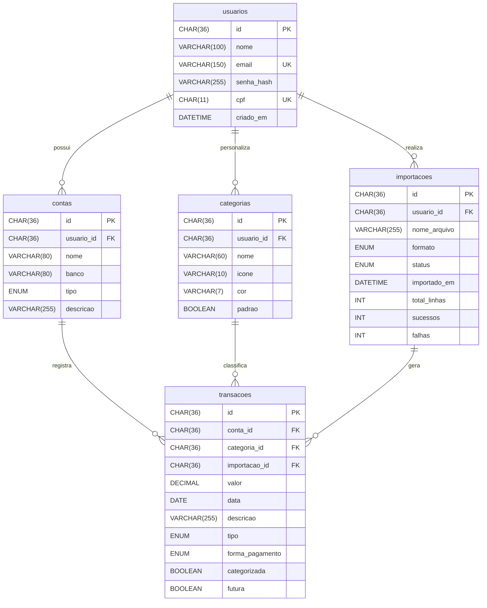

```mermaid
erDiagram
 
  usuarios {
    CHAR(36)     id              PK
    VARCHAR(100) nome
    VARCHAR(150) email           UK
    VARCHAR(255) senha_hash
    CHAR(11)     cpf             UK
    DATETIME     criado_em
  }
 
  contas {
    CHAR(36)     id              PK
    CHAR(36)     usuario_id      FK
    VARCHAR(80)  nome
    VARCHAR(80)  banco
    ENUM         tipo
    VARCHAR(255) descricao
  }
 
  categorias {
    CHAR(36)    id              PK
    CHAR(36)    usuario_id      FK
    VARCHAR(60) nome
    VARCHAR(10) icone
    VARCHAR(7)  cor
    BOOLEAN     padrao
  }
 
  transacoes {
    CHAR(36)     id              PK
    CHAR(36)     conta_id        FK
    CHAR(36)     categoria_id    FK
    CHAR(36)     importacao_id   FK
    DECIMAL      valor
    DATE         data
    VARCHAR(255) descricao
    ENUM         tipo
    ENUM         forma_pagamento
    BOOLEAN      categorizada
    BOOLEAN      futura
  }
 
  importacoes {
    CHAR(36)     id              PK
    CHAR(36)     usuario_id      FK
    VARCHAR(255) nome_arquivo
    ENUM         formato
    ENUM         status
    DATETIME     importado_em
    INT          total_linhas
    INT          sucessos
    INT          falhas
  }
 
  usuarios    ||--o{ contas       : "possui"
  usuarios    ||--o{ categorias   : "personaliza"
  usuarios    ||--o{ importacoes  : "realiza"
  contas      ||--o{ transacoes   : "registra"
  categorias  ||--o{ transacoes   : "classifica"
  importacoes ||--o{ transacoes   : "gera"
```
