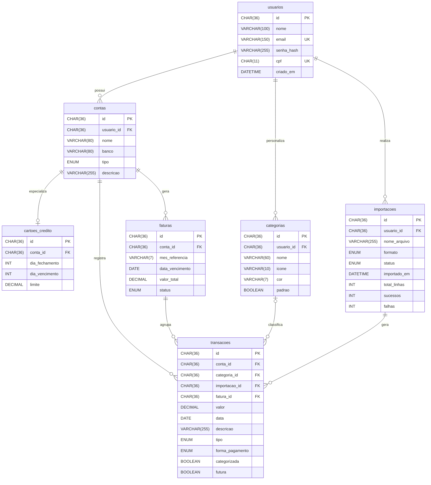

```mermaid
erDiagram
 
  usuarios {
    CHAR(36)     id              PK
    VARCHAR(100) nome
    VARCHAR(150) email           UK
    VARCHAR(255) senha_hash
    CHAR(11)     cpf             UK
    DATETIME     criado_em
  }
 
  contas {
    CHAR(36)     id              PK
    CHAR(36)     usuario_id      FK
    VARCHAR(80)  nome
    VARCHAR(80)  banco
    ENUM         tipo
    VARCHAR(255) descricao
  }
  
  %%O campo decimal tem uma limitação (10,2)
  %%O campo limite vai ficar como opcional no momento já que essa funcionalidade não está dentro do MVP e vai contra o risco R04.

  cartoes_credito {
    CHAR(36)     id              PK
    CHAR(36)     conta_id        FK
    INT          dia_fechamento
    INT          dia_vencimento
    DECIMAL      limite
  }
 
    %%O campo decimal tem uma limitação (10,2)

  faturas {
    CHAR(36)     id              PK
    CHAR(36)     conta_id        FK
    VARCHAR(7)   mes_referencia
    DATE         data_vencimento
    DECIMAL      valor_total
    ENUM         status
  }
 
  categorias {
    CHAR(36)     id              PK
    CHAR(36)     usuario_id      FK
    VARCHAR(60)  nome
    VARCHAR(10)  icone
    VARCHAR(7)   cor
    BOOLEAN      padrao
  }
 
    %%O fatura_id não é obrigatório nessa tabela, ou seja ele pode ser null

    %%O campo decimal tem uma delimitação (10,2)

  transacoes {
    CHAR(36)     id              PK
    CHAR(36)     conta_id        FK
    CHAR(36)     categoria_id    FK
    CHAR(36)     importacao_id   FK
    CHAR(36)     fatura_id       FK
    DECIMAL      valor
    DATE         data
    VARCHAR(255) descricao
    ENUM         tipo
    ENUM         forma_pagamento
    BOOLEAN      categorizada
    BOOLEAN      futura
  }
 
  importacoes {
    CHAR(36)     id              PK
    CHAR(36)     usuario_id      FK
    VARCHAR(255) nome_arquivo
    ENUM         formato
    ENUM         status
    DATETIME     importado_em
    INT          total_linhas
    INT          sucessos
    INT          falhas
  }
 
  usuarios        ||--o{ contas           : "possui"
  usuarios        ||--o{ categorias       : "personaliza"
  usuarios        ||--o{ importacoes      : "realiza"
  contas          ||--o| cartoes_credito  : "especializa"
  contas          ||--o{ transacoes       : "registra"
  contas          ||--o{ faturas          : "gera"
  faturas         ||--o{ transacoes       : "agrupa"
  categorias      |o--o{ transacoes       : "classifica"
  importacoes     ||--o{ transacoes       : "gera"

```
