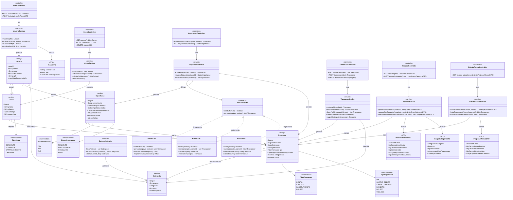

```mermaid
classDiagram
  direction TB

 
  class Usuario {
    <<entity>>
    +long id
    +String nome
    +String email
    +String senhaHash
    +String cpf
    +LocalDateTime criadoEm
  }
 
  class Conta {
    <<entity>>
    +long id
    +String nome
    +String banco
    +TipoConta tipo
    +String descricao
  }
 
  class Transacao {
    <<entity>>
    +long id
    +BigDecimal valor
    +LocalDate data
    +String descricao
    +TipoTransacao tipo
    +TipoPagamento formaPagamento
    +Boolean categorizada
    +Boolean futura
  }
 
  class Categoria {
    <<entity>>
    +long id
    +String nome
    +String icone
    +String cor
    +Boolean padrao
  }
 
  class Importacao {
    <<entity>>
    +long id
    +String nomeArquivo
    +FormatoArquivo formato
    +StatusImportacao status
    +LocalDateTime importadoEm
    +Integer totalLinhas
    +Integer sucessos
    +Integer falhas
  }
 
  class TipoConta {
    <<enumeration>>
    CORRENTE
    POUPANCA
    CARTAO_CREDITO
    CARTEIRA
  }
 
  class TipoTransacao {
    <<enumeration>>
    DEBITO
    CREDITO
    PARCELAMENTO
    BOLETO
  }
 
  class TipoPagamento {
    <<enumeration>>
    PIX
    CARTAO_DEBITO
    CARTAO_CREDITO
    DINHEIRO
    BOLETO
    TED_DOC
  }
 
  class FormatoArquivo {
    <<enumeration>>
    CSV
    XML
    TXT
  }
 
  class StatusImportacao {
    <<enumeration>>
    PENDENTE
    PROCESSANDO
    CONCLUIDO
    ERRO
  }
 
  class UsuarioService {
    <<service>>
    +registrar(dto) Usuario
    +autenticar(email, senha) TokenDTO
    +buscarPorId(id) Usuario
    +atualizarPerfil(id, dto) Usuario
  }
 
  class ContaService {
    <<service>>
    +criar(usuarioId, dto) Conta
    +listarPorUsuario(usuarioId) List~Conta~
    +calcularSaldo(contaId) BigDecimal
    +remover(contaId)
  }
 
  class TransacaoService {
    <<service>>
    +registrarManual(dto) Transacao
    +listarPorConta(contaId) List~Transacao~
    +listarPorMes(usuarioId, mes) List~Transacao~
    +categorizar(transacaoId, categoriaId)
    +sugerirCategoria(descricao) Categoria
  }
 
  class ImportacaoService {
    <<service>>
    +processar(arquivo, contaId) Importacao
    +buscarStatus(importacaoId) StatusImportacao
    +listarPorUsuario(usuarioId) List~Importacao~
  }
 
  class CategoriaService {
    <<service>>
    +listarPadrao() List~Categoria~
    +listarPorUsuario(usuarioId) List~Categoria~
    +criar(usuarioId, dto) Categoria
  }
 
  class ResumoService {
    <<service>>
    +gerarResumoMensal(usuarioId, mes) ResumoMensalDTO
    +agruparPorCategoria(usuarioId, mes) List~GrupoCategoriaDTO~
    +agruparPorFormaPagamento(usuarioId, mes) List~GrupoPagamentoDTO~
  }
 
  class ExtratoFuturoService {
    <<service>>
    +calcularProjecao(usuarioId, meses) List~ProjecaoMensalDTO~
    +listarTransacoesFuturas(usuarioId) List~Transacao~
    +calcularTotalPrevisto(usuarioId, mes) BigDecimal
  }
 
  class ParserExtrato {
    <<interface>>
    +aceita(formato) Boolean
    +parsear(arquivo, contaId) List~Transacao~
  }
 
  class ParserCSV {
    +aceita(formato) Boolean
    +parsear(arquivo, contaId) List~Transacao~
    -detectarDelimitador(linha) Char
    -mapearColunas(cabecalho) Map
  }
 
  class ParserXML {
    +aceita(formato) Boolean
    +parsear(arquivo, contaId) List~Transacao~
    -extrairNos(doc) NodeList
    -mapearCampos(no) Transacao
  }
 
  class ParserNFe {
    +aceita(formato) Boolean
    +parsear(arquivo, contaId) List~Transacao~
    -validarChaveAcesso(chave) Boolean
    -extrairItens(nfe) List~Transacao~
  }
 
  class TokenDTO {
    <<DTO>>
    +String accessToken
    +String tipo
    +LocalDateTime expiracao
  }
 
  class ResumoMensalDTO {
    <<DTO>>
    +YearMonth mes
    +BigDecimal totalGasto
    +BigDecimal totalRecebido
    +BigDecimal saldo
    +String categoriaMaiorGasto
    +BigDecimal percentualVariacao
  }
 
  class GrupoCategoriaDTO {
    <<DTO>>
    +String nomeCategoria
    +String cor
    +BigDecimal total
    +Integer quantidadeTransacoes
    +Double percentual
  }
 
  class ProjecaoMensalDTO {
    <<DTO>>
    +YearMonth mes
    +BigDecimal saldoPrevisto
    +BigDecimal totalDebitos
    +BigDecimal totalCreditos
    +Integer quantidadeVencimentos
  }
 
 
  class AuthController {
    <<controller>>
    +POST /auth/register(dto) TokenDTO
    +POST /auth/login(dto) TokenDTO
  }
 
  class ContaController {
    <<controller>>
    +GET /contas() List~Conta~
    +POST /contas(dto) Conta
    +DELETE /contas/id()
  }
 
  class TransacaoController {
    <<controller>>
    +GET /transacoes(mes) List~Transacao~
    +POST /transacoes(dto) Transacao
    +PATCH /transacoes/id/categoria(dto)
  }
 
  class ImportacaoController {
    <<controller>>
    +POST /importacoes(arquivo, contaId) Importacao
    +GET /importacoes/id/status() StatusImportacao
  }
 
  class ResumoController {
    <<controller>>
    +GET /resumo(mes) ResumoMensalDTO
    +GET /resumo/categorias(mes) List~GrupoCategoriaDTO~
  }
 
  class ExtratoFuturoController {
    <<controller>>
    +GET /extrato-futuro(meses) List~ProjecaoMensalDTO~
  }

 
  Usuario "1" --> "0..*" Conta : possui
  Usuario "1" --> "0..*" Importacao : realiza
  Usuario "1" --> "0..*" Categoria : personaliza
  Conta "1" --> "0..*" Transacao : registra
  Transacao "0..*" --> "1" Categoria : classificada em
  Importacao "1" --> "0..*" Transacao : gera
  Conta --> TipoConta
  Transacao --> TipoTransacao
  Transacao --> TipoPagamento
  Importacao --> FormatoArquivo
  Importacao --> StatusImportacao
 
  ImportacaoService --> ParserExtrato : delega
  ParserExtrato <|.. ParserCSV : implementa
  ParserExtrato <|.. ParserXML : implementa
  ParserExtrato <|.. ParserNFe : implementa
  ImportacaoService --> Importacao : persiste
  ImportacaoService --> Transacao : persiste
  TransacaoService --> Transacao : gerencia
  TransacaoService --> Categoria : consulta
  ContaService --> Conta : gerencia
  UsuarioService --> Usuario : gerencia
  CategoriaService --> Categoria : gerencia
  ResumoService --> Transacao : agrega
  ResumoService --> ResumoMensalDTO : retorna
  ResumoService --> GrupoCategoriaDTO : retorna
  ExtratoFuturoService --> Transacao : consulta
  ExtratoFuturoService --> ProjecaoMensalDTO : retorna
  UsuarioService --> TokenDTO : retorna
 
  AuthController --> UsuarioService : usa
  ContaController --> ContaService : usa
  TransacaoController --> TransacaoService : usa
  ImportacaoController --> ImportacaoService : usa
  ResumoController --> ResumoService : usa
  ExtratoFuturoController --> ExtratoFuturoService : usa
```
